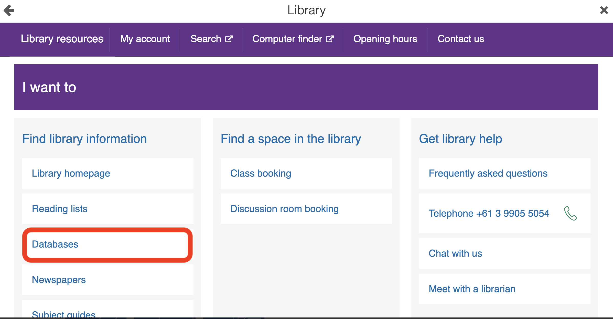
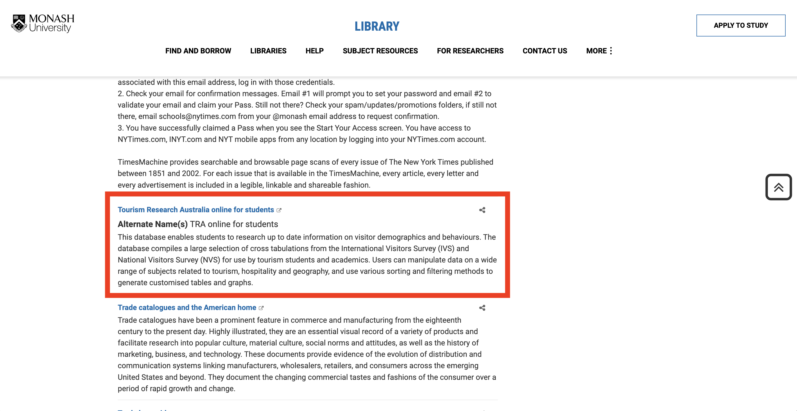

```{r, include = FALSE}
knitr::opts_chunk$set(
  collapse = TRUE,
  comment = "#>"
)
```

```{r setup}
knitr::opts_chunk$set(eval = FALSE, include = FALSE)
library(ecotourism)

```

## Instructions to Find the Dataset

This dataset is exclusively accessible to Monash University students or staff. However, other universities in Australia may have similar platforms and datasets that can utilize this package.

**Steps:**

1.  Go to [my.monash](https://my.monash/campusm/home#menu).

2.  Select the Library section. .

3.  Choose Databases. .

4.  Pick A-Z Databases. .

5.  Select Tourism Research Australia online for students. .

6.  Click on Student Databases and double click on "Domestic Overnight Trips".

7.  Select quarters, click on all of them, and add them to rows. .

8.  In the stopover section, find "Stopover state/region/SA2", click on the subsection SA2, and then add it to rows. .

9.  You will encounter this prompt. . Simply click "Ok".

10. Now it's time to choose columns. Go to the "Stopover reason" section and select "Holiday", "Visiting friends and relatives", "Business", and any other reasons, then click on columns. .

11. The final step is to go to Summation options, click on "Overnight trips (000) Sum", and in the top right corner, click on "Download table". .
